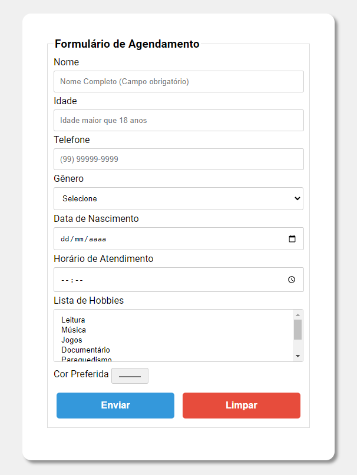

# Projeto Vem Ser Tech - Ada/iFood - Exercício 5 - Trabalhando com formulários

→ Crie um formulário de agendamento com os seguintes campos:

- Nome (campo obrigatório)
- Idade (Precisa ser maior de 18 anos)
- Telefone (campo obrigatório, utilize o pattern="^\(\d{2}\) \d{5}-\d{4}$" ex: (11) 99999-9999)
- Gênero (Masculino ou Feminino)
- Data de nascimento (campo obrigatório, data entre 01/01/1900 e 01/01/2099)
- Horário de atendimento (campo obrigatório, das 7:00 às 17:00)
- Lista de Hobbies (minimo 7, pode selecionar mais de um)
- Selecionar uma cor preferida (minimo 7 cores)
- Botão Enviar
- Botão Limpar

### Requisitos:

→ Utilize *label*, *fieldset* e *legend* para uma melhor experiência do usuário.
→ Crie classes no CSS para estilizar o formulário.
→ Utilize *variaveis* no CSS.

